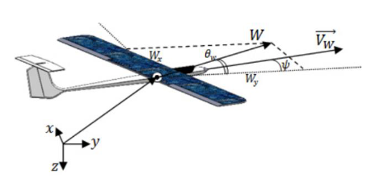
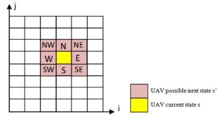

<h1 style="text-align: center;">Wind-Energy based Path Planning for Electric Unmanned Aerial Vehicles Using Markov Decision Processes</h1>
<h3 style="text-align: right;">Based on <a href=https://robotics.usc.edu/~ryan/Publications_files/ICRA_2013_wesam.pdf>paper</a></h3>

 
## 1.  Motivation  
Unmanned Aerial Vehicles (UAVs) are small, electric-powered aircraft used in both military and civilian applications. Coastal or border surveillance, atmospheric and climate research, remote environment, forestry, agricultural, and oceanic monitoring and imagery for the media and real-estate industries are all possible applications for such aircraft. However, one of the most significant limitations of small UAVs is their flight endurance due to the limited amount of onboard (fuel/battery) that can be carried. For planning the best route, it is critical for these vehicles to harness fluctuating and unknown environmental circumstances (horizontal wind, vertical wind) in order to maximise flight length and minimise power usage. Due of the vehicle's small size, the unpredictable amplitude and direction of the wind can really cause uncontrollable forcing to be applied to it. 
 
 
## 2.  Introduction 
The authors of this paper incorporate the uncertainty of the wind field into the wind model and plan using a Markov Decision Process (MDP). Because the wind velocity is unclear, the authors proposed that the next state be treated as a random variable, with a probability distribution generated over all adjacent cells. The motion planning problem is then to select the actions (horizontal and 
vertical actuation of the balloon) that minimise time to goal given these transition probabilities from all states. The MDP finds the best immediate action for each current state in order to reduce the predicted cumulative time-to-goal. Using a Gaussian model and a modified MDP technique, the suggested method provides the optimal power-based path, the path that uses the least amount of onboard energy while taking into account the fluctuation in wind magnitude and direction over time to reach a certain target point. As a result, this problem is readily formulated as a Markov Decision Process (S; A; P; R), where S symbolises the set of potential states of the aircraft; A denotes the set of possible actions of the aircraft; The transition probabilities are represented by P.  For each transition and action, R defines the expected immediate reward. 
 
 
## 3. Problem Statement 
We reduce the problem for this study by addressing a three-dimensional planer problem (movement in three dimensions but not rotation). The three degrees of freedom are represented by the 𝑥−𝑝𝑜𝑠𝑖𝑡𝑖𝑜𝑛, 𝑦−𝑝𝑜𝑠𝑖𝑡𝑜𝑛, and heading angle 𝜓. The height of the AV z−𝑝𝑜𝑠𝑖𝑡𝑖𝑜𝑛 will remain constant.  

**Problem Description**: Compute a path for a UAV that uses an unknown, time-varying wind field and minimises energy consumption given two points (Start and Target points). 

MDP's parameters are as follows: 
1)  Possible states (S): 
The Cartesian coordinates of the state of the UAV at the centre of a cell will be denoted by $𝑆_{𝑖,𝑗} =𝑥_{𝑖,𝑗}, 𝑦_{𝑖,𝑗}, 𝜓_{𝑖,𝑗}$ where $𝑥_{𝑖,𝑗}, 𝑦_{𝑖,𝑗}, 𝜓_{𝑖,𝑗}$ denote x position, y position and heading angle for the UAV at $𝑐𝑒𝑙𝑙_{𝑖,𝑗}$ respectively. Velocity of the aircraft is constant and equal to the Minimum Level-Flight Speed ($𝑉_{𝑚𝑖𝑛}$).   

2)  Actions available from each state (A): 
We assume that the UAV can move in eight directions, 𝐴 = 𝑁,𝑁𝐸,𝐸,𝑆𝐸,𝑆,𝑆𝑊,𝑊,𝑁𝑊. 
  

3)  Transition probabilities (P): 
The transition probabilities $𝑃: 𝑃_{𝑠,𝑎}(𝑠,𝑠′)$ manage the probabilities of what state 𝑠′ is entered after executing each action A from state 𝑠. 
A method based on Gaussian distribution to assign a realistic transition probabilities $𝑃_{𝑠,𝑎}(𝑠,𝑠′)$ in a time varying wind field to fit inside the MDP framework was used. The time-varying wind field is approximated by a Gaussian distribution, at each time step a vector is chosen from the distribution to find the direction and magnitude of the wind field

$$ P : P_{s,s'} = \dfrac{1}{\sigma\sqrt{2\pi}}\int_{\theta _ b - \frac{\pi}{8}}^{\theta _ a + \frac{\pi}{8}} e^{\frac{-1}{2}(\frac{v - w}{\sigma})^2} \,dv $$

The Standard deviation will be selected by the user and is constant 

5)  Reward for each transition and each action (R): 
The ratio between the wind component facing the target point and the maximum expected wind value will be calculated and multiplying the result by a weight (C) - where (C) is selected by the user.

$$ R_a(s_{i,j}) = \dfrac{W_{i,j}\cos(\theta _ {i,j} + \theta _ T)}{W_{max}}C$$ 

to this 2C was added if the UAV was in its target state and -5 was added in all other states. 
 
 
## 4.  Approach Taken 
The value function $(V(s))$ for a cell will be equal to, 

$$ V(s_{i,j}) := E[R_a(s_{i,j}) + \gamma \Sigma (P_{s,a}(s, s') V(s'))]$$

The optimal value function $(V^∗(s))$ for a cell will be given by, 

$$ V^*(s_{i,j}) := max_a E[R_a(s_{i,j}) + \gamma \Sigma (P_{s,a}(s, s') V(s'))]$$

where 𝑠 is the initial state, 𝑠′ the next possible state, $𝑅_𝑎(𝑠_{𝑖,𝑗})$ is the possible reward in state $𝑠_{𝑖,𝑗}$ taken an action 𝑎, $𝑃_{𝑠,𝑎}(𝑠,𝑠′)$  is the probability of reaching 𝑠′ while applying action 𝑎 in state $𝑠_{𝑖,𝑗}$ , and 𝑉 (𝑠′) is the value function for state 𝑠′. 
 
Identifying the optimal values $𝑉^∗(𝑠)$ will lead to determining the optimal policy $𝜋^∗(𝑠)$ using,

$$ \pi^*(s) = argmax_a(R_a(s_{i,j}) + \gamma\Sigma_{s' \in S} (P_{s,a}(s, s') V^∗(s')))$$ 

The value Iteration algorithm was implemented to generate the optimal policy.

With the help of libraries such as numpy and scipy, all the necessary functions related to the environment were implemented in the Windfield_Env.py file while the value iteration algorithm and the play policy function were implemented in the Agent .py file.
